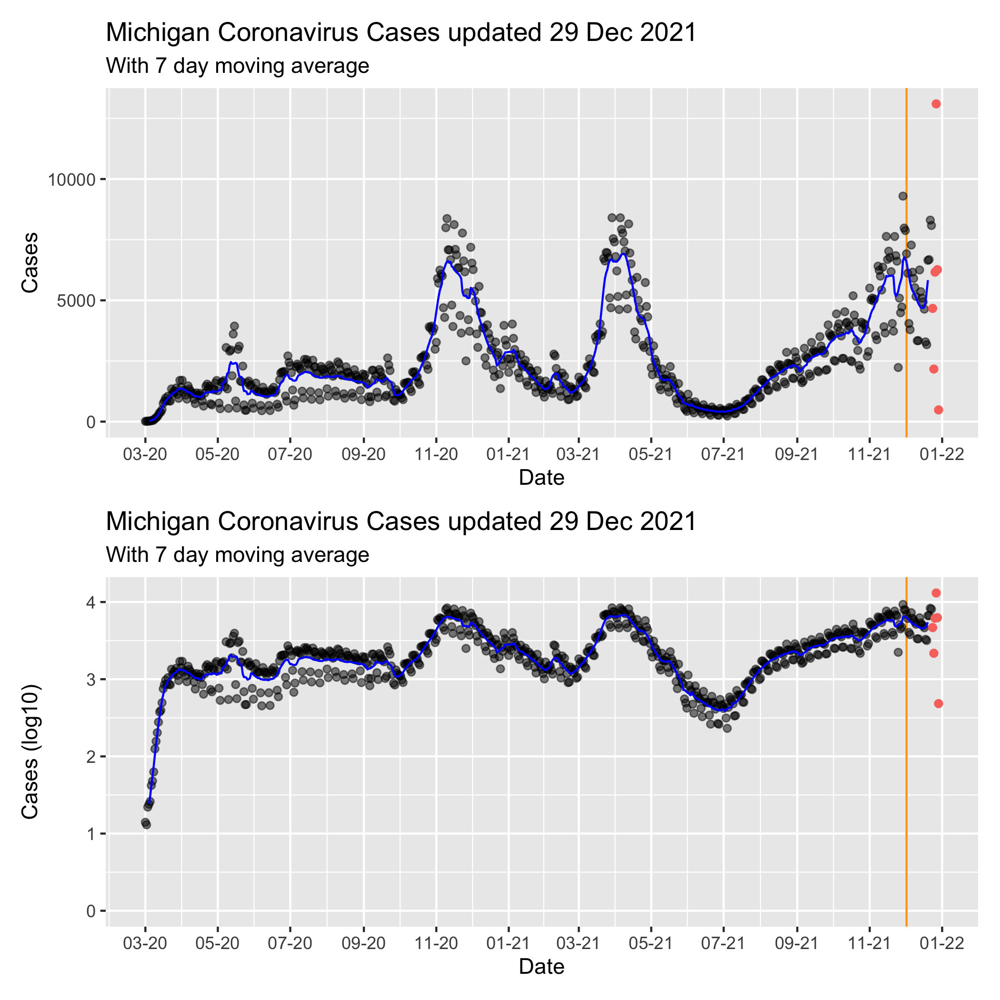

Michigan COVID Data
================
Adam D. DenHaan
Jan 11, 2021

``` python
from urllib.request import urlopen
from bs4 import BeautifulSoup


url = "https://www.michigan.gov/coronavirus/0,9753,7-406-98163_98173---,00.html"

html = urlopen(url).read().decode("utf-8")
start_index = html.find("shortdesc")
end_index = html.find("footerArea")
data = html[start_index:end_index]

soup = BeautifulSoup(data)
links = [link.get('href') for link in soup.find_all('a')]

finallink = "https://michigan.gov" + \
    [i for i in links if "by_Date" in i][0]
```

Read in data:

``` r
link = py$finallink

download.file(link, destfile = "data/covid.xlsx")

mi_data = readxl::read_excel("data/covid.xlsx")

glimpse(mi_data)
```

    ## Rows: 55,449
    ## Columns: 8
    ## $ COUNTY            <chr> "Alcona", "Alcona", "Alcona", "Alcona", "Alcona", "…
    ## $ Date              <dttm> 2020-03-01, 2020-03-02, 2020-03-03, 2020-03-04, 20…
    ## $ CASE_STATUS       <chr> "Confirmed", "Confirmed", "Confirmed", "Confirmed",…
    ## $ Cases             <dbl> 0, 0, 0, 0, 0, 0, 0, 0, 0, 0, 0, 0, 0, 0, 0, 0, 0, …
    ## $ Deaths            <dbl> 0, 0, 0, 0, 0, 0, 0, 0, 0, 0, 0, 0, 0, 0, 0, 0, 0, …
    ## $ Cases.Cumulative  <dbl> 0, 0, 0, 0, 0, 0, 0, 0, 0, 0, 0, 0, 0, 0, 0, 0, 0, …
    ## $ Deaths.Cumulative <dbl> 0, 0, 0, 0, 0, 0, 0, 0, 0, 0, 0, 0, 0, 0, 0, 0, 0, …
    ## $ Updated           <dttm> 2021-01-09 15:11:10, 2021-01-09 15:11:10, 2021-01-…

Wrangle Data:

``` r
date_update = format(max(mi_data$Updated), '%d %b %Y')

mi_cases_by_day = mi_data %>% 
  # filter(COUNTY == "Kent") %>%
  group_by(Date) %>%
  mutate(
    Cases = sum(Cases),
    Date = date(Date)
  ) 

# linkdate <- as.Date(strsplit(link, "_")[[1]][16])
# linkandnowdiff <- day(now()) - day(linkdate)

day_split = 7

mi_cases_by_day_exclusive <- mi_cases_by_day %>%
  dplyr::filter(                                   #most recent data is often inaccurate and revised
    Date < date(now()) - day_split + 1,
  )

mi_cases_by_day_last4 <- mi_cases_by_day %>%
  dplyr::filter(                         
    Date >= date(now()) - day_split + 1,
  )
```

Visualization:

``` r
mi_cases_by_day_exclusive %>%
  ggplot(mapping = aes(x = Date, y = Cases)) +
  geom_vline(xintercept = today()-21, color = "orange") +
  ylim(c(0,NA)) +
  geom_point() + 
  geom_smooth(method = "gam", formula = y ~ s(x, bs = "cs", k = 20)) +
  geom_point(
    data = mi_cases_by_day_last4,
    mapping = aes(x = Date, y = Cases, color = "red"),
  ) +
  scale_x_date(date_labels = "%m-%d",
               date_breaks = "1 month") + 
  theme(legend.position = "none") +
  labs(title = paste("Michigan Coronavirus Cases, updated ", date_update))
```

    ## Warning: Removed 1 rows containing missing values (geom_smooth).

<!-- -->

Note that the last 5 days of data have been colored red on the graph, as
they frequently change as more information becomes available. Vertical
orange line at 3 weeks in the past (as hospitalizations usually follow
cases by three weeks).
