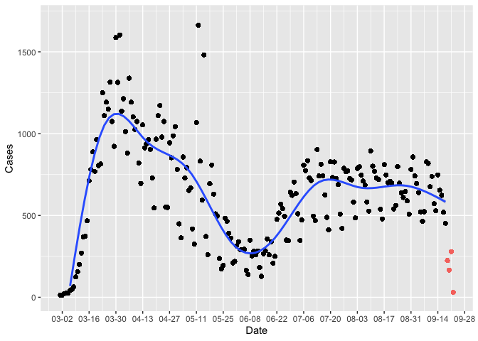

Michigan COVID Data
================
Adam DenHaan
9/17/2020

Read in data:

``` r
download.file("https://www.michigan.gov/documents/coronavirus/Cases_by_County_and_Date_2020-09-22_703063_7.xlsx", destfile = "/tmp/file.xlsx")
mi_data = data.frame(readxl::read_excel("/tmp/file.xlsx"))
head(mi_data)
```

    ##   COUNTY       Date CASE_STATUS Cases Deaths Cases.Cumulative Deaths.Cumulative
    ## 1 Alcona 2020-03-01   Confirmed     0      0                0                 0
    ## 2 Alcona 2020-03-02   Confirmed     0      0                0                 0
    ## 3 Alcona 2020-03-03   Confirmed     0      0                0                 0
    ## 4 Alcona 2020-03-04   Confirmed     0      0                0                 0
    ## 5 Alcona 2020-03-05   Confirmed     0      0                0                 0
    ## 6 Alcona 2020-03-06   Confirmed     0      0                0                 0
    ##               Updated
    ## 1 2020-09-22 14:10:26
    ## 2 2020-09-22 14:10:26
    ## 3 2020-09-22 14:10:26
    ## 4 2020-09-22 14:10:26
    ## 5 2020-09-22 14:10:26
    ## 6 2020-09-22 14:10:26

Manipulate Data:

``` r
mi_cases_by_day = mi_data %>% 
  na.omit() %>%
  group_by(Date) %>%
  mutate(Cases = sum(Cases)) %>%
  filter(                         #most recent data is often inaccurate and revised
    date(Date) != date(now()),
    date(Date) != date(now()) - 1,
    date(Date) != date(now()) - 2,
    date(Date) != date(now()) - 3,
    date(Date) != date(now()) - 4,
  )

mi_cases_by_day %>%
  ggplot(mapping = aes(x = date(Date), y = Cases)) +
  ylim(c(0,1700)) +
  geom_point() + 
  geom_smooth() +
  scale_x_date(date_labels = "%m-%d",
               date_breaks = "2 weeks") + 
  labs(x = "Date")
```

    ## `geom_smooth()` using method = 'gam' and formula 'y ~ s(x, bs = "cs")'

    ## Warning: Removed 2 rows containing missing values (geom_smooth).

<!-- -->
