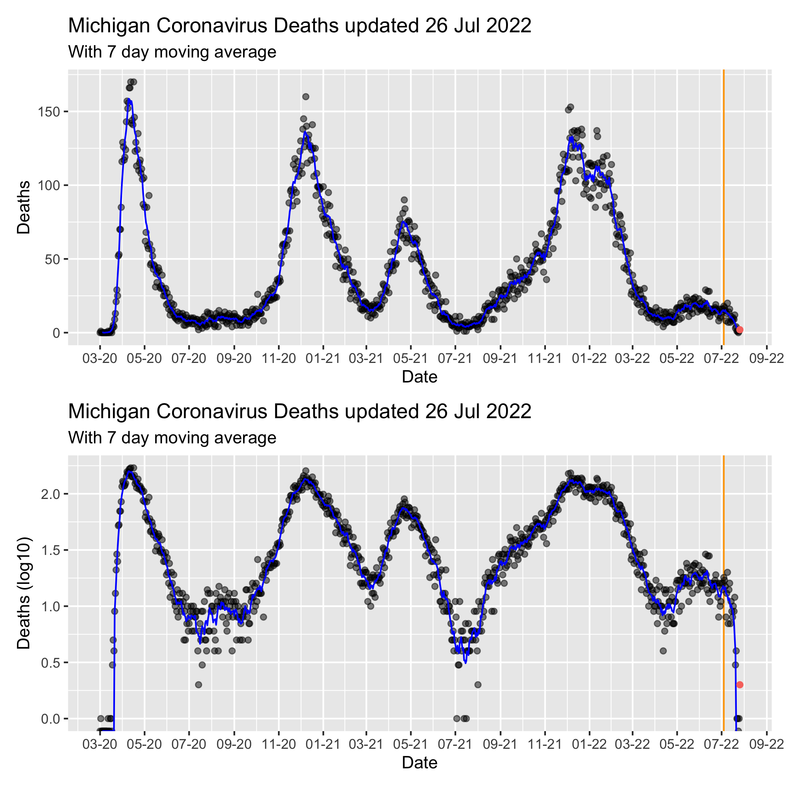

Michigan COVID Data
================
Adam D. DenHaan
Apr 07, 2022

Get link for data:

``` python
from bs4 import BeautifulSoup
from urllib.request import urlopen
from datetime import datetime, timedelta


# Get data into pandas df
url = "https://www.michigan.gov/coronavirus/0,9753,7-406-98163_98173---,00.html"

html = urlopen(url).read().decode("utf-8")
start_index = html.find("shortdesc")
end_index = html.find("footerArea")
data = html[start_index:end_index]

soup = BeautifulSoup(data, features="html.parser")
links = [link.get('href') for link in soup.find_all('a')]

finallink = "https://michigan.gov" + \
    [i for i in links if "by_Date" in i][0]
```

Download data:

``` r
temp <- tempfile()
download.file(py$finallink, destfile = temp)
mi_data = readxl::read_excel(temp)
```

Clean data:

``` python
mi_data = r.mi_data
mi_data.head()
```

    ##    COUNTY       Date CASE_STATUS  Cases  Deaths  Cases.Cumulative  \
    ## 0  Alcona 2020-03-01   Confirmed    0.0     0.0               0.0   
    ## 1  Alcona 2020-03-02   Confirmed    0.0     0.0               0.0   
    ## 2  Alcona 2020-03-03   Confirmed    0.0     0.0               0.0   
    ## 3  Alcona 2020-03-04   Confirmed    0.0     0.0               0.0   
    ## 4  Alcona 2020-03-05   Confirmed    0.0     0.0               0.0   
    ## 
    ##    Deaths.Cumulative                       Updated  
    ## 0                0.0 2022-04-06 13:57:08.617000192  
    ## 1                0.0 2022-04-06 13:57:08.617000192  
    ## 2                0.0 2022-04-06 13:57:08.617000192  
    ## 3                0.0 2022-04-06 13:57:08.617000192  
    ## 4                0.0 2022-04-06 13:57:08.617000192

``` python
max_date = max(mi_data["Updated"])

agg_data = mi_data.groupby(["Date"], as_index=False).sum()

diff = datetime.now() - timedelta(7)
  
mi_cases_by_day_last4 = agg_data[agg_data["Date"] > diff]
agg_data = agg_data[agg_data["Date"] <= diff]
```

``` r
mi_cases_by_day_exclusive = py$agg_data
date_update = format(py$max_date, '%d %b %Y')
mi_cases_by_day_last4 = py$mi_cases_by_day_last4
```

Visualization:

``` r
ma <- function(x, n = 7){stats::filter(x, rep(1 / n, n), sides = 2)}

viz_function <- function(df, df2, x, y, vertline = TRUE, log = FALSE) {
  
  if (log) {
    df  <- df  %>% mutate(y = log10({{y}}))
    df2 <- df2 %>% mutate(y = log10({{y}}))
    y_lbl = paste(deparse(substitute(y)), "(log10)")
  } else {
    df  <- df  %>% mutate(y = {{y}})
    df2 <- df2 %>% mutate(y = {{y}})
    y_lbl = deparse(substitute(y))
  }
  
  # Moving average
  avg = ma(df["y"])
  df = bind_cols(df, avg = avg)
  
  plot <- ggplot(data = df, mapping = aes(x = as.Date({{x}}), y = y)) +
    ylim(c(0,NA)) +
    geom_point(alpha = .5) +
    geom_line(y = avg, color = "blue") +
    geom_point(
      data = df2,
      mapping = aes(x = as.Date({{x}}), y = y, color = "red")
    ) +
    scale_x_date(date_labels = "%m-%y", date_breaks = "2 months") + 
    theme(legend.position = "none") +
    labs(
      title = paste("Michigan Coronavirus", deparse(substitute(y)), "updated", date_update),
      subtitle = "With 7 day moving average",
      x = deparse(substitute(x)),
      y = y_lbl
    )
  
  if (vertline) {
    plot <- append_layers(
      plot,
      geom_vline(xintercept = today() - 28, color = "orange"),
      position = "bottom"
    )
  }
  plot
}
```

``` r
viz_function(mi_cases_by_day_exclusive, mi_cases_by_day_last4, Date, Cases, vertline = FALSE) /
  viz_function(mi_cases_by_day_exclusive, mi_cases_by_day_last4, Date, Cases, log = TRUE, vertline = FALSE)
```

<!-- -->

``` r
viz_function(mi_cases_by_day_exclusive, mi_cases_by_day_last4, Date, Deaths, vertline = FALSE) / 
  viz_function(mi_cases_by_day_exclusive, mi_cases_by_day_last4, Date, Deaths, vertline = FALSE, log = TRUE)
```

<!-- -->

Note that the last 6 days of data have been colored red on the graph, as
they frequently change as more information becomes available.
